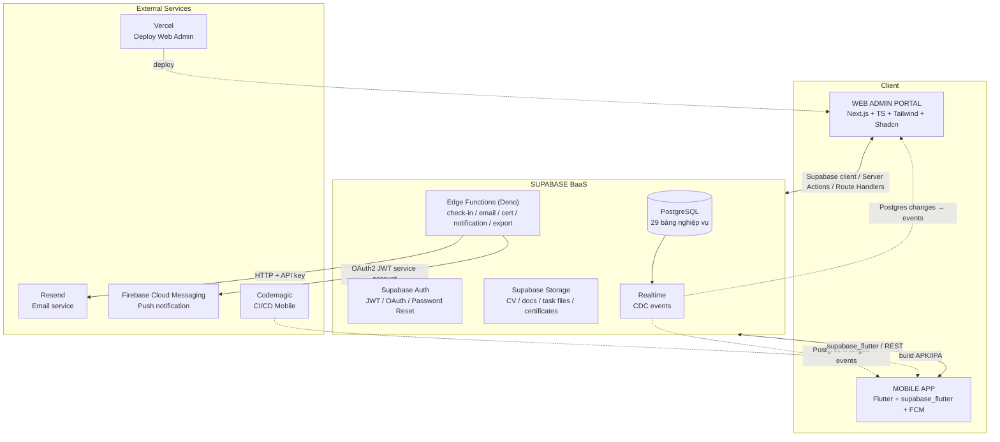
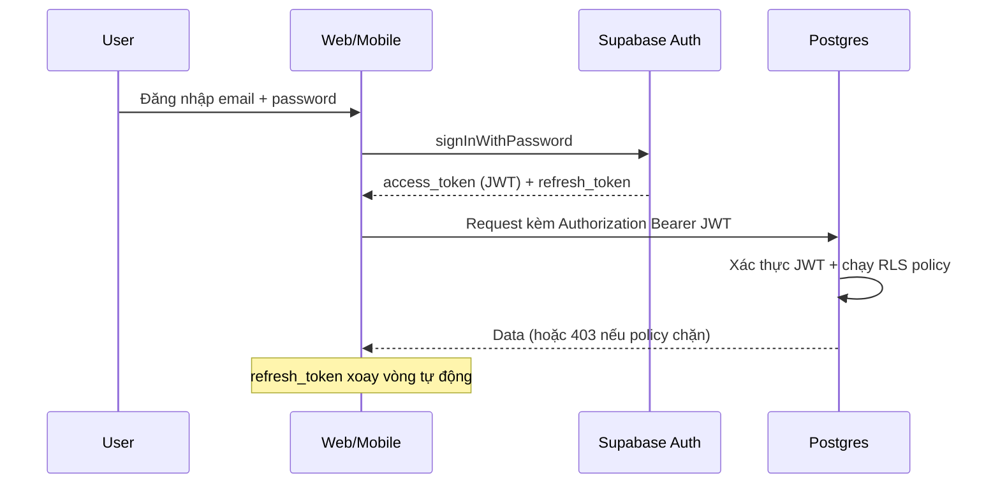
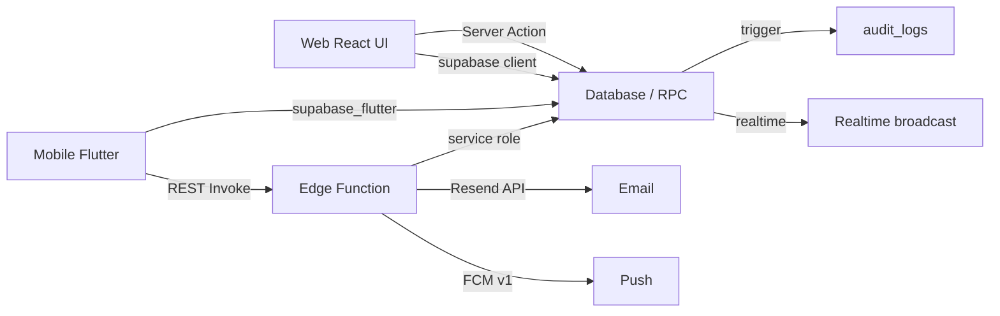

# IMS – PHẦN 1: SYSTEM ARCHITECTURE

## 1. Tổng quan

IMS gồm 3 thành phần: **Web Admin Portal** (Next.js), **Mobile App** (Flutter), nền tảng **Supabase** (PostgreSQL + Auth + Storage + Realtime + Edge Functions). Email qua **Resend**, Push Notification qua **Firebase Cloud Messaging (FCM)**.

## 2. Luồng dữ liệu giữa Web, Mobile và Supabase

| Hướng | Client | Kênh | Ví dụ |
|---|---|---|---|
| Đọc | Web | Supabase **Server Component** (RLS qua session cookie) | Dashboard, danh sách interns |
| Đọc nhanh | Web | Supabase **Client** (RLS, anon key) | Tables có filter/pagination |
| Mutation an toàn | Web | **Server Action** → tạo instance server, gọi RPC/DB (service role khi cần) | Import intern, gửi email, duyệt đơn |
| Export file | Web | **Route Handler** | Xuất ngày công CSV |
| Đọc | Mobile | **supabase_flutter** (RLS, JWT) | Task của tôi, attendance của tôi |
| Ghi nhạy cảm | Mobile | **Edge Function** | Check-in/check-out (GPS), nộp báo cáo |
| Sự kiện trực tiếp | Cả hai | **Realtime** subscribe | Report được duyệt, task mới |
| Mail | Cả hai | Edge Function → **Resend** | Welcome, approve, certificate |
| Push | Mobile | EF → **FCM** | Task mới, đơn được duyệt |

## 3. Authentication & Authorization

Quy tắc:
- JWT chứa `sub` (auth.users.id). Role **luôn** đọc từ DB qua `get_my_role()` — không tin claim `role` do client gửi.
- Web dùng `@supabase/ssr` (cookie session) cho Server Components; client code chỉ chứa anon key.
- Service role key chỉ nằm trong Edge Function / Server Action (server-side).
- End-user không bao giờ thấy kế hoạch service role.

## 4. RLS

Mọi bảng có dữ liệu người dùng đều bật RLS. Policy gọi helper `SECURITY DEFINER` (cache theo session) để tránh đệ quy:

- `get_my_role()` → role của người dùng hiện tại.
- `is_mentor_of(user_id)` → Mentor có phân công quản lý intern đó trong `internships`.
- `get_my_intern_id()` / `get_my_internship_id()` → dữ liệu liên kết.

Chi tiết đầy đủ (từng bảng, từng policy): `supabase/migrations/0005_rls_policies.sql`.

## 5. Realtime

Realtime phát các sự kiện Postgres changes (insert/update/delete) trên các bảng: `tasks`, `task_comments`, `daily_reports`, `weekly_reports`, `leave_requests`, `work_from_home_requests`, `late_requests`, `notifications`, `evaluations`, `attendance`.

- Web/Mobile subscribe các bảng mà role được đọc (RLS áp dụng cho realtime khi `supabase_realtime` publication vẫn đi qua policy).
- Mobile tap notification → navigate sâu tới màn hình chi tiết.

## 6. Edge Functions

Logic **server-side bắt buộc**, không cho client ghi trực tiếp:

| Function | Mục đích |
|---|---|
| `check-in` | Validate GPS/server-side, tạo attendance |
| `send-welcome-email` | Gửi onboarding email qua Resend |
| `send-notification` | Insert notification + push FCM |
| `generate-certificate` | Sinh PDF chứng nhận, upload Storage, insert certificate |
| `calculate-evaluation` | Tổng hợp điểm đánh giá |
| `export-attendance` | Xuất CSV ngày công |

Khi **không** dùng Edge Function: CRUD thông thường cho phép RLS (chạy trực tiếp). Khi **không** dùng DB trigger cho nghiệp vụ: trigger chỉ đảm nhận việc duy trì dữ liệu (updated_at, audit, xóa mềm, tạo profile), còn nghiệp vụ có I/O ngoài (email/push) thì qua EF/Server Action.

## 7. Storage

Bucket: `avatars`, `cvs`, `onboarding`, `task-attachments`, `report-attachments`, `request-attachments`, `certificates`. Filesize giới hạn 10 MB, whitelist MIME. Storage policies đồng bộ với role (chi tiết `0006_storage.sql`).

## 8. Email (Resend)

Gửi từ **server-side duy nhất** (EF hoặc Server Action dùng service role). Templates: welcome, account info, task assigned, report approved/rejected, request approved/rejected, internship completed, certificate ready.

## 9. Push Notification (FCM)

1. Mobile đăng ký FCM → plugin lấy device token.
2. App upsert vào `notification_devices` (RLS: user tự quản token của mình).
3. Sự kiện nghiệp vụ → EF `send-notification` (service role) insert `notifications`.
4. EF gọi HTTP v1 FCM với service account → push tới token.
5. App xử lý foreground/background/terminated → điều hướng.

## 10. Cách các thành phần giao tiếp

- **Không** có server API riêng đứng giữa: dùng Supabase làm service layer với RLS.
- Next.js Server Actions chỉ đóng vai trò "controller" cho nghiệp vụ cần server secret/validation ngoài phạm vi RLS.