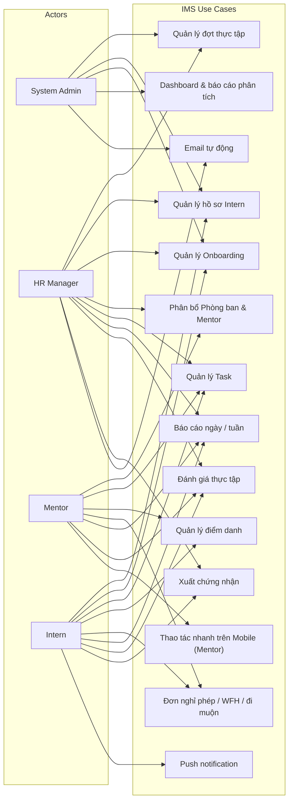
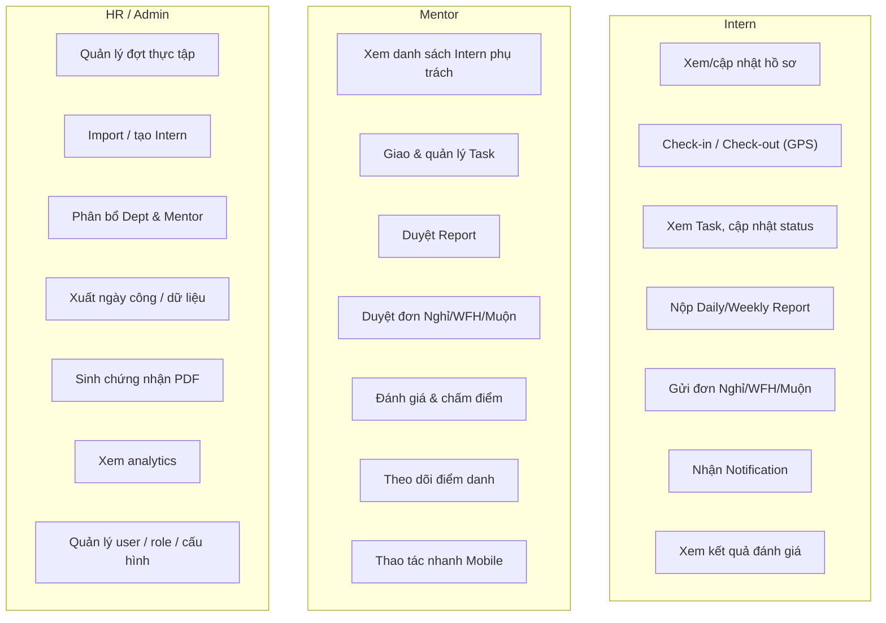
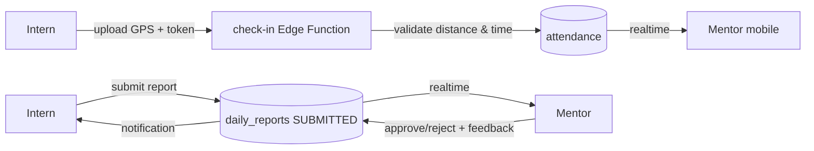

# IMS – PHẦN 3: USE CASE DIAGRAM

## 3.1. Toàn hệ thống

```mermaid
flowchart LR
    subgraph Actors
        Admin["System Admin"]
        HR["HR Manager"]
        Mentor["Mentor"]
        Intern["Intern"]
    end

    subgraph UC["IMS Use Cases"]
        UC1["Quản lý đợt thực tập"]
        UC2["Quản lý hồ sơ Intern"]
        UC3["Quản lý Onboarding"]
        UC4["Phân bổ Phòng ban & Mentor"]
        UC5["Quản lý Task"]
        UC6["Quản lý điểm danh"]
        UC7["Đơn nghỉ phép / WFH / đi muộn"]
        UC8["Báo cáo ngày / tuần"]
        UC9["Đánh giá thực tập"]
        UC10["Xuất chứng nhận"]
        UC11["Dashboard & báo cáo phân tích"]
        UC12["Email tự động"]
        UC13["Push notification"]
        UC14["Thao tác nhanh trên Mobile (Mentor)"]
    end

    Admin --> UC1
    Admin --> UC2
    Admin --> UC3
    Admin --> UC11
    Admin --> UC12
    HR --> UC1
    HR --> UC2
    HR --> UC3
    HR --> UC4
    HR --> UC5
    HR --> UC8
    HR --> UC9
    HR --> UC10
    HR --> UC12
    Mentor --> UC4
    Mentor --> UC5
    Mentor --> UC6
    Mentor --> UC7
    Mentor --> UC8
    Mentor --> UC9
    Mentor --> UC14
    Intern --> UC2
    Intern --> UC3
    Intern --> UC5
    Intern --> UC6
    Intern --> UC7
    Intern --> UC8
    Intern --> UC9
    Intern --> UC10
    Intern --> UC13
```

## 3.2. Luồng chính theo role

```mermaid
flowchart TB
    subgraph InternUC["Intern"]
        I1["Xem/cập nhật hồ sơ"]
        I2["Check-in / Check-out (GPS)"]
        I3["Xem Task, cập nhật status"]
        I4["Nộp Daily/Weekly Report"]
        I5["Gửi đơn Nghỉ/WFH/Muộn"]
        I6["Nhận Notification"]
        I7["Xem kết quả đánh giá"]
    end

    subgraph MentorUC["Mentor"]
        M1["Xem danh sách Intern phụ trách"]
        M2["Giao & quản lý Task"]
        M3["Duyệt Report"]
        M4["Duyệt đơn Nghỉ/WFH/Muộn"]
        M5["Đánh giá & chấm điểm"]
        M6["Theo dõi điểm danh"]
        M7["Thao tác nhanh Mobile"]
    end

    subgraph HRAdminUC["HR / Admin"]
        H1["Quản lý đợt thực tập"]
        H2["Import / tạo Intern"]
        H3["Phân bổ Dept & Mentor"]
        H4["Xuất ngày công / dữ liệu"]
        H5["Sinh chứng nhận PDF"]
        H6["Xem analytics"]
        H7["Quản lý user / role / cấu hình"]
    end
```

## 3.3. Chi tiết một số use case

```mermaid
flowchart LR
    I["Intern"] -->|"upload GPS + token"| EF["check-in Edge Function"]
    EF -->|"validate distance & time"| DB[("attendance")]
    DB -->|"realtime"| M["Mentor mobile"]

    I2["Intern"] -->|"submit report"| DB2[("daily_reports SUBMITTED")]
    DB2 -->|"realtime"| M2["Mentor"]
    M2 -->|"approve/reject + feedback"| DB2
    DB2 -->|"notification"| I2
```