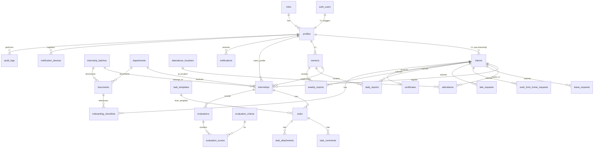

# IMS – PHẦN 4: DATABASE (ERD & TABLE SPEC)

> Chi tiết đầy đủ (câu lệnh DDL, constraint, index, trigger) nằm trong:
> `supabase/migrations/0001_enums.sql`, `0002_tables.sql`, `0003_indexes.sql`, `0004_functions_triggers.sql`.

## 4.1. Sơ đồ quan hệ tổng quan



## 4.2. Danh sách bảng

| # | Bảng | Mục đích | Soft delete |
|---|---|---|---|
| 1 | `roles` | Danh mục vai trò (admin, hr, mentor, intern) | — |
| 2 | `profiles` | Hồ sơ người dùng 1:1 với `auth.users` | — |
| 3 | `departments` | Phòng ban | ✅ |
| 4 | `internship_batches` | Đợt thực tập | ✅ |
| 5 | `interns` | Hồ sơ thực tập sinh | ✅ |
| 6 | `mentors` | Hồ sơ mentor | ✅ |
| 7 | `internships` | Ghi nhận Intern trong 1 đợt + phòng ban + mentor | ✅ |
| 8 | `documents` | Tài liệu onboarding (link file or url) | — |
| 9 | `onboarding_checklists` | Checklist onboarding của intern | — |
| 10 | `task_templates` | Mẫu task theo phòng ban | ✅ |
| 11 | `tasks` | Công việc giao cho intern | — |
| 12 | `task_comments` | Bình luận task | — |
| 13 | `task_attachments` | File đính kèm task | — |
| 14 | `attendance_locations` | Địa điểm điểm danh + radius GPS | — |
| 15 | `attendance` | Bản ghi check-in/check-out | — |
| 16 | `leave_requests` | Đơn nghỉ phép | — |
| 17 | `work_from_home_requests` | Đơn WFH | — |
| 18 | `late_requests` | Đơn đi muộn / về sớm | — |
| 19 | `daily_reports` | Báo cáo ngày | — |
| 20 | `weekly_reports` | Báo cáo tuần | — |
| 21 | `evaluation_criteria` | Tiêu chí đánh giá | — |
| 22 | `evaluations` | Phiếu đánh giá (weekly/midterm/final/360) | — |
| 23 | `evaluation_scores` | Điểm theo từng tiêu chí | — |
| 24 | `certificates` | Chứng nhận thực tập | — |
| 25 | `notifications` | Thông báo trong hệ thống | — |
| 26 | `notification_devices` | Token FCM của thiết bị | — |
| 27 | `audit_logs` | Nhật ký thao tác | — |
| 28 | `system_settings` | Cấu hình hệ thống | — |

## 4.3. Quy ước chung

- Mọi bảng có `id uuid PK DEFAULT gen_random_uuid()`, `created_at timestamptz DEFAULT now()`, `updated_at timestamptz DEFAULT now()` (trigger `set_updated_at`).
- Bảng nghiệp vụ không soft delete để giữ lịch sử/luồng duyệt.
- Trigger `handle_updated_at()` cập nhật `updated_at`; trigger `log_audit()` ghi `audit_logs`.
- Index: mọi FK + composite cho query thường dùng (xem `0003_indexes.sql`).

## 4.4. Enum

```sql
user_role             → admin | hr | mentor | intern
intern_status         → pending | onboarding | active | completed | cancelled | converted
internship_status     → upcoming | active | completed | cancelled
task_status           → todo | in_progress | review | done
task_priority         → low | medium | high | urgent
request_type          → leave | wfh | late | early_leave | other
request_status        → pending | approved | rejected | cancelled
report_status         → draft | submitted | approved | rejected
report_type           → daily | weekly
evaluation_type       → weekly | midterm | final | feedback_360
attendance_status     → present | late | absent | leave | wfh | early_leave | weekend
day_status            → working_day | weekend | holiday
notification_type     → task_assigned | task_updated | report_approved | report_rejected |
                       request_approved | request_rejected | evaluation | certificate |
                       system | message
onboarding_status     → not_started | in_progress | completed
certificate_status    → draft | issued | revoked
```

## 4.5. Trọng tâm: các trường quan trọng

| Bảng | Trường | Kiểu | Ràng buộc / ghi chú |
|---|---|---|---|
| `profiles` | `email` | text | UNIQUE (đồng bộ auth.users.email) |
| `profiles` | `role_id` | uuid FK→roles | — |
| `interns` | `student_code`, `email` | text | UNIQUE |
| `interns` | `birth_date`, `phone`, `address` | date/text | nullable |
| `interns` | `cv_file_path` | text | nullable |
| `mentors` | `employee_code`, `email` | text | UNIQUE |
| `mentors` | `max_interns` | int DEFAULT 10 | CHECK ≥ 1 |
| `internships` | `intern_id`, `batch_id`, `department_id`, `mentor_id` | uuid FK | composite UNIQUE (intern_id, batch_id) |
| `internships` | `status` | internship_status DEFAULT 'upcoming' | — |
| `internships` | `start_date`, `end_date` | date | CHECK end ≥ start |
| `tasks` | `internship_id` FK, `created_by` FK→profiles | uuid | NOT NULL |
| `tasks` | `title`, `description`, `priority`, `deadline`, `status` | — | status CHECK |
| `attendance` | `intern_id`, `location_id` | uuid FK | — |
| `attendance` | `check_in_at`, `check_out_at` | timestamptz | CHECK out ≥ in |
| `attendance` | `status` | attendance_status | — |
| `certificates` | `intern_id`, `certificate_code` | uuid/text | code UNIQUE |
| `evaluations` | `internship_id`, `reviewer_id`, `type` | uuid/uuid/enum | UNIQUE (internship_id, reviewer_id, type) |
| `evaluation_scores` | `evaluation_id`, `criterion_id`, `score`, `comment` | uuid/uuid/int/text | CHECK score 0–100 |
| `notifications` | `user_id`, `type`, `title`, `body`, `data`, `read_at` | uuid/enum/text/text/jsonb/tz | — |
| `notification_devices` | `user_id`, `device_token`, `platform` | uuid/text/text | token UNIQUE |
| `audit_logs` | `user_id`, `action`, `entity`, `entity_id`, `old_data`, `new_data`, `ip_address` | — | ghi bởi trigger |