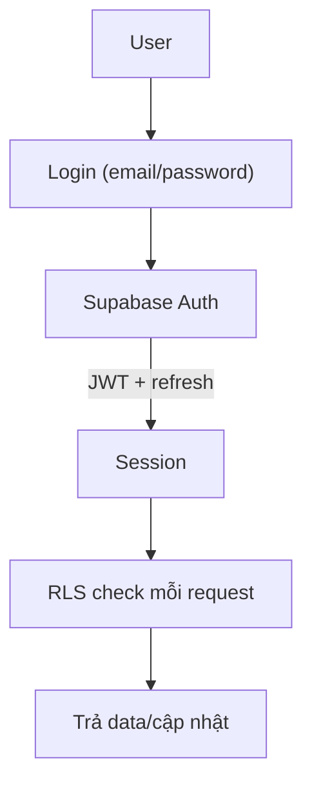
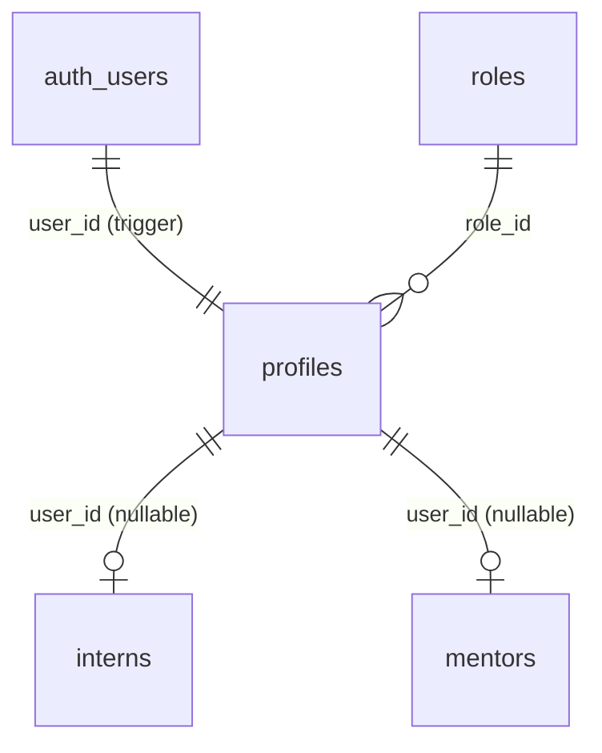

# IMS – PHẦN 6: AUTHENTICATION

## 6.1. Luồng tổng quan

- Dùng **Supabase Auth** (email/password mặc định). Không lưu password trong bảng nghiệp vụ (`auth.users` quản lý — bcrypt bởi GoTrue).
- Session: Web dùng cookie (SSR) qua `@supabase/ssr`; Mobile giữ access/refresh token trong secure storage.

## 6.2. Login

- Web: `(auth)/login` → `signInWithPassword({ email, password })` → lưu cookie → redirect theo role (dashboard/path phù hợp).
- Mobile: `AuthDataSource.login()` → `supabase.auth.signInWithPassword()` → navigate Home.

## 6.3. Logout

- Web: `signOut()` → xóa cookie → redirect `/login`.
- Mobile: `supabase.auth.signOut()` → clear storage → về Login.

## 6.4. Refresh Token

- Auto: client library tự refresh; `enable_refresh_token_rotation = true`, `refresh_token_reuse_interval = 10`.
- Mobile: nếu refresh lỗi → logout force, hiện thông báo "Phiên hết hạn".

## 6.5. Password Reset

- Email → `resetPasswordForEmail()` → link → trang set password mới.
- Edge Function `send-welcome-email` cũng dùng chung template account info (kèm link tạm reset).

## 6.6. Quên mật khẩu (Web)

Route `(auth)/forgot-password` → nhập email → gửi link Reset qua Resend (Next.js route handler gọi resend, KHÔNG để key client).

## 6.7. Role & Redirect

- Sau login, đọc `profiles.role_id` trái phép để điều hướng:
  - admin/hr → `/dashboard`
  - mentor → `/dashboard` (kèm dữ liệu phụ trách)
  - intern → chặn web admin (login web không cho intern; intern dùng Mobile) — **OPTIONAL** nếu muốn cho intern dùng web.
- `middleware.ts` bảo vệ route: chưa login → `/login`; sai role → 403 page.

## 6.8. Tạo tài khoản (chỉ Admin/HR)

- Edge Function `admin-create-user` sẽ: `auth.admin.createUser` (service role) → tạo `profiles`/`interns`/`mentors` → gửi email chào mừng. (Bản phase 2: dùng Server Action + service role.)

## 6.9. Kiến trúc relation

