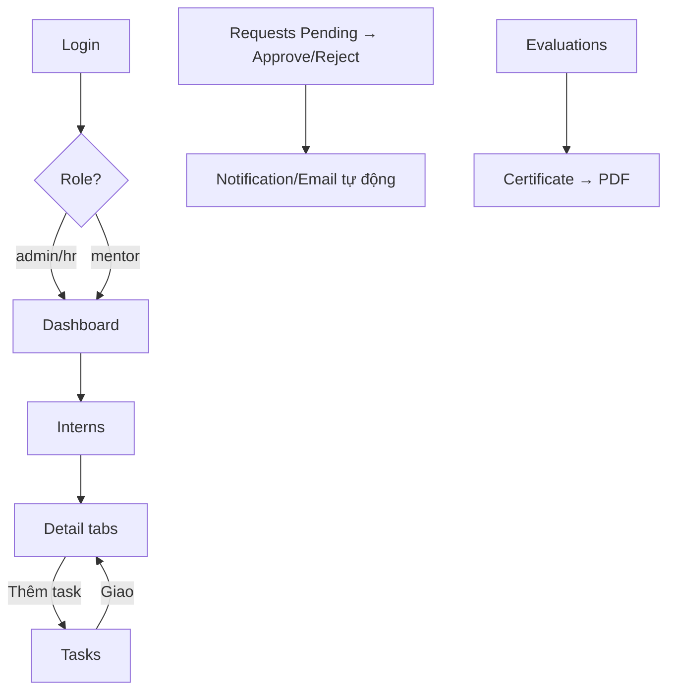

# IMS – PHẦN 8: WEB ADMIN (Next.js)

## 8.1. Sitemap

```text
/                         → redirect theo role
/login
/forgot-password
/reset-password
/dashboard                → KPI + charts + alerts
/interns                  → list/search/filter/pagination
/interns/new import       → form tạo / import (OPTIONAL)
/interns/[id]             → tabs: Hồ sơ · CV · Task · Điểm danh · Báo cáo · Đánh giá
/mentors
/mentors/[id]             → intern phụ trách
/departments
/internship-batches
/onboarding               → checklist + documents + send welcome
/tasks                    → Kanban + List + template
/attendance               → lịch sử + export
/requests                 → duyệt leave/wfh/late
/reports                  → duyệt daily/weekly
/evaluations              → phiếu đánh giá + tổng hợp
/certificates             → sinh + xuất PDF
/settings
/users
/audit-logs
```

## 8.2. Route structure (App Router)

```text
web-admin/
├── app/
│   ├── (auth)/login/page.tsx
│   ├── (auth)/forgot-password/page.tsx
│   ├── (auth)/reset-password/page.tsx
│   ├── (dashboard)/layout.tsx        ← Sidebar + Topbar + Breadcrumb
│   ├── (dashboard)/dashboard/page.tsx
│   ├── (dashboard)/interns/page.tsx
│   ├── (dashboard)/interns/[id]/page.tsx
│   ├── (dashboard)/tasks/page.tsx
│   ├── (dashboard)/requests/page.tsx
│   ├── (dashboard)/reports/page.tsx
│   ├── (dashboard)/evaluations/page.tsx
│   ├── (dashboard)/certificates/page.tsx
│   ├── api/…                         ← Route Handlers (export, webhook)
│   └── layout.tsx                    ← QueryClient, Toaster, ThemeProvider
├── components/                       ← shadcn + business components
├── features/                         ← từng module (actions, queries, components)
├── lib/supabase/                     ← server/client/admin client, auth helpers
├── hooks/
├── types/
├── utils/
└── middleware.ts                     ← role guard
```

## 8.3. UI components (dùng shadcn/ui)

- `Sidebar` (menu theo role), `Topbar` (search, notifications, profile menu), `Breadcrumb`.
- `DataTable` (server-side pagination + search + filter + sort + column visibility).
- `Card`/`Skeleton`, `Dialog`/`Sheet`, `Tabs`, `DropdownMenu`, `Calendar` (date-picker), `Toast/Sonner`.
- Charts: `Recharts` (line/bar/donut).
- Trạng thái: loading (skeleton), empty state, error state, confirm dialog, toast error từ error code chuẩn.

## 8.4. Data fetching pattern

| Trường hợp | Cách |
|---|---|
| Server component cần data initial | Truy vấn qua supabase client (cookie) |
| Query phức + revalidate | Server Action hoặc RPC |
| Mutation có secret/email | Server Action |
| Table lớn | Client + `@tanstack/react-query` + key RLS |
| Export | Route handler trả file CSV/PDF |

## 8.5. UI flow chính



## 8.6. Responsive

- Desktop-first; breakpoint < lg ẩn bớt cột, dùng drawer sidebar; mobile scale cho bảng bằng horizontal scroll.