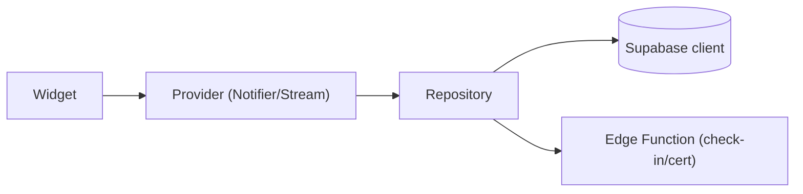

# IMS – PHẦN 9: MOBILE APP (Flutter)

## 9.1. Danh sách màn hình

```text
Login / ForgotPassword / ResetPassword
Home (Intern) ── Dashboard tổng hợp
  ├ Task hôm nay · deadline sắp tới
  ├ Trạng thái điểm danh hôm nay
  ├ Báo cáo cần nộp · Đơn đang chờ
  └ Notification list / inbox
Attendance ── Check-in / Check-out (GPS) + lịch sử
Tasks ── List → Detail (status, deadline, priority, attachment, result upload)
DailyReport / WeeklyReport ── form nộp + draft + kết quả
Requests ── Leave / WFH / Late → form + track trạng thái
Profile ── hồ sơ cá nhân, đánh giá, chứng nhận
MentorView ── (role mentor):
  ├ Danh sách intern phụ trách → chi tiết (attendance, tasks)
  ├ Duyệt báo cáo (xem + approve/reject + feedback)
  ├ Duyệt đơn leave/wfh/late
  └ Chấm điểm + feedback nhanh
Notifications ── pull + FCM deep link
```

## 9.2. Navigation

Route stack đơn giản với `go_router` (path-based, deep-link):
`/login` → `/home` → `/home/tasks/:id`, `/home/attendance`, `/home/reports`, `/home/requests`, `/notifications/:id`, `/mentor/...`.

## 9.3. State management

**Riverpod**:
- `AuthController` (session stream, role, sign-in/out).
- `DashboardController`, `TaskController`, `ReportController`, `RequestController`, `AttendanceController`, `NotificationController`.
- Repository layer: `*Repository` gọi Supabase/Edge Function, expose `AsyncValue`/`Stream`.
- DI: `ProviderScope` với shared instances.



## 9.4. API integration

- `supabase_flutter` client duy nhất; interceptor kiểm tra session; tự refresh.
- Edge Function gọi qua `supabase.functions.invoke()`.

## 9.5. GPS check-in flow

```mermaid
flowchart TB
    A["Mở màn hình điểm danh"] --> B["Lấy vị trí (geolocator)"]
    B --> C{"Permission?"}
    C -->|denied| D["Yêu cầu bật + UI cảnh báo"]
    C -->|granted| E["Gọi EF check-in<br/>{lat, lng (terse), timestamp}"]
    E --> F["Server: khoảng cách Haversine ≤ radius?"]
    F -->|trong||HD["Cho check-in → ghi attendance"]
    F -->|ngoài||NG["Từ chối: GPS_VALIDATION_ERROR"]
    HD --> SE["Server cũng trả check-in dựa trên giờ hệ thống<br/>không tin giờ máy"]
```

- Fail nếu không có internet hoặc thiếu permission → offline queue → sync lại khi có mạng (retry tối đa 3 lần).
- Server chỉ nhận 2 decrypt số thập phân (khoảng 1.1 km sai số), radius mặc định 200m nhưng config mỗi location.

## 9.6. Notification flow

1. Init Firebase; FCM token → upsert `notification_devices` (RLS: chỉ user sở hữu).
2. Foreground: `FirebaseMessaging.onMessage` → show trong-app + badge.
3. Background/terminated: trả về `RemoteMessage` → `go_router` điều hướng theo `data.screen` + `data.id`.
4. Đọc notification từ Supabase (đồng bộ giữa devices).

## 9.7. Mentor quick actions

Dashboard mentor: badge "Báo cáo chờ duyệt", "Đơn chờ duyệt" — một chạm mở danh sách → approve/reject một cái vuốt. Tối ưu thao tác nhanh như spec.