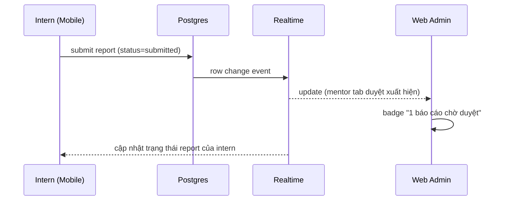

# IMS – PHẦN 10: REALTIME

## 10.1. Nguyên tắc

- Bật Realtime publication (Postgres changes) cho các bảng liên quan; RLS vẫn áp dụng khi subscribe (client chỉ nhận events mình được phép).
- Không phát toàn bộ payload nhạy cảm — dùng bản ghi thay đổi + fetch chi tiết khi cần.

## 10.2. Bảng subscribe & event

| Bảng | Event | Client nhận | Kết quả UI |
|---|---|---|---|
| `tasks` | INSERT/UPDATE | intern của task, mentor phụ trách, hr/admin | Refresh task + badge + push |
| `task_comments` | INSERT | các bên trong task | Cập nhật thread |
| `daily_reports` / `weekly_reports` | UPDATE | intern (chủ sở hữu), mentor phụ trách | Status thay đổi, hiện feedback |
| `leave_requests` / `work_from_home_requests` / `late_requests` | INSERT/UPDATE | intern, mentor phụ trách | Track trạng thái |
| `notifications` | INSERT | chủ sở hữu | Badge + in-app toast |
| `evaluations` | INSERT/UPDATE | intern (kết quả), mentor | Refresh evaluation |
| `attendance` | INSERT/UPDATE | intern (chính mình), mentor phụ trách | Điểm danh live |
| `internships` | UPDATE | mentor/admin/hr | Cập nhật phân bổ |

## 10.3. Flow

## 10.4. Cấu hình

- `config.toml`: `[realtime] enabled = true`.
- Migration tạo publication `supabase_realtime` gồm các bảng trên:
  `ALTER PUBLICATION supabase_realtime ADD TABLE …;`
- Web dùng `createClientChannel('*')` với filter theo `user_id`/`internship_id`; Mobile dùng `supabase.channel(...).on('postgres_changes', ...)`.