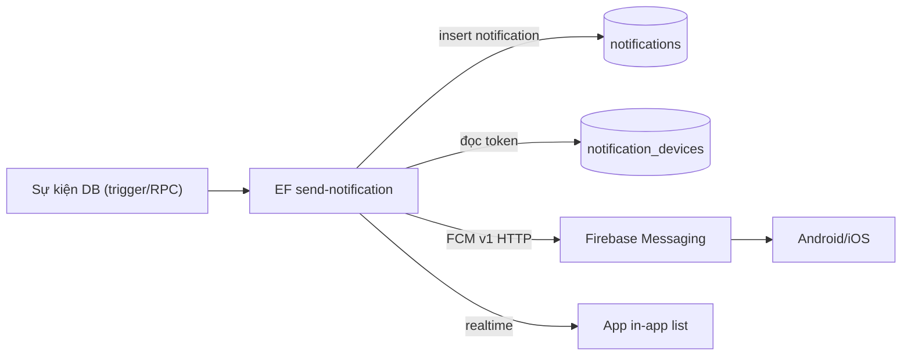

# IMS – PHẦN 13: PUSH NOTIFICATION (FCM)

## 13.1. Sự kiện → Push

| Sự kiện | Payload data | Screen (deep link) |
|---|---|---|
| Task được giao | `{screen: tasks, id}` | `/home/tasks/{id}` |
| Task thay đổi status | `{screen: tasks, id}` | `/home/tasks/{id}` |
| Report được duyệt | `{screen: reports_daily, id}` | `/home/reports/{id}` |
| Report bị từ chối | `{screen: reports_daily, id}` | `/home/reports/{id}` |
| Đơn nghỉ được duyệt | `{screen: requests_leave, id}` | `/home/requests/leave/{id}` |
| Đơn nghỉ bị từ chối | `{screen: requests_leave, id}` | `/home/requests/leave/{id}` |
| Thông báo từ Mentor/HR | `{screen: notifications}` | `/notifications` |
| Có tin nhắn mới (**OPTIONAL**) | `{screen: chat, id}` | `/chat/{id}` |
| Có đánh giá mới | `{screen: evaluations, id}` | `/home/evaluations/{id}` |

## 13.2. Architecture

## 13.3. Xử lý phía Mobile

- `FirebaseMessaging` init; yêu cầu permission; `onTokenRefresh` → upsert lại token.
- Foreground: `onMessage` → `OverlayEntry` banner → update badge.
- Background/terminated: `getInitialMessage` / `onMessageOpenedApp` → navigate theo `data.screen/id`.
- Đồng bộ trạng thái đã đọc: PATCH `notifications.read_at` (RLS: chủ sở hữu).

## 13.4. Security

- Server giữ `FCM_PRIVATE_KEY` + `FCM_CLIENT_EMAIL` (edge only); client chỉ nắm Firebase config public (không phải secret).
- Token binding theo user (RLS `user_id = auth.uid()`), chỉ gửi push tới token của user đích.
- Rate-limit + message size ≤ 4KB.