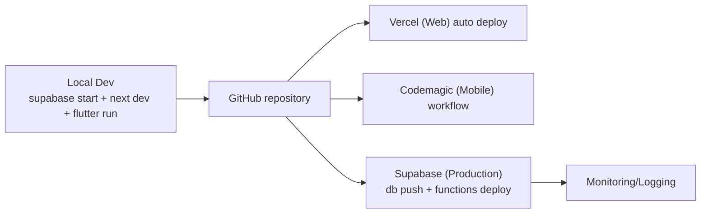

# IMS – PHẦN 16: DEPLOYMENT

## 16.1. Local

- `supabase start` (Docker) — DB + Auth + Storage + EF local.
- `npm run dev` trong `web-admin`.
- `flutter run` trong `mobile` (kết nối localhost backend khi dev Android emulator dùng `10.0.2.2`).

## 16.2. GitHub

- Branch `main` protect; PR có CI job: lint + typecheck + unit test + secret scan.

## 16.3. Vercel (Web Admin)

- Import repo `web-admin/`.
- Env vars: `NEXT_PUBLIC_SUPABASE_URL`, `NEXT_PUBLIC_SUPABASE_ANON_KEY` (public — OK), `SUPABASE_SERVICE_ROLE_KEY`, `RESEND_API_KEY` (server-only).
- Framework preset Next.js; domain production cập nhật vào `additional_redirect_urls` của Supabase Auth.
- Preview env dùng project `staging`.

## 16.4. Supabase Production

1. `supabase link --project-ref <ref>`
2. `supabase db push` (migrations).
3. `supabase functions deploy check-in send-notification ...`
4. `supabase secrets set RESEND_API_KEY=... FCM_PRIVATE_KEY=... FCM_CLIENT_EMAIL=... FCM_PROJECT_ID=...`
5. Storage buckets + policies (đã trong migration).
6. Bật `enable_signup=false`, xác lập backup PITR, email SMTP thật.

## 16.5. Codemagic (Mobile)

- Workflow trong `mobile/codemagic.yaml` (triển khai Phase 3/5):
  - build Android `appbundle` (release signing) + iOS `archive/export`.
  - chạy `flutter test`, `flutter analyze`.
  - publish tới internal testing (Play Console / TestFlight).
- Env: `SUPABASE_URL`, `SUPABASE_ANON_KEY`, FCM config tương ứng flavor.

## 16.6. Monitoring & Backup

- Supabase logs (Postgres + Edge Functions) qua dashboard.
- Vercel Analytics cho web.
- Alerting: pg heartbeat + uptime check.
- Database backup: PITR (Pro) hoặc `supabase db dump` cron.

## 16.7. Rollback

- DB: migrations idempotent, có hướng down (`migration_file.down.sql` khi cần); dùng `supabase db reset` cho dev; production rollback qua migration mới (không sửa migration đã chạy).
- Web: instant redeploy Vercel (previous build).
- Mobile: hotfix version + Codemagic rebuild → store review (fastlane ưu tiên).