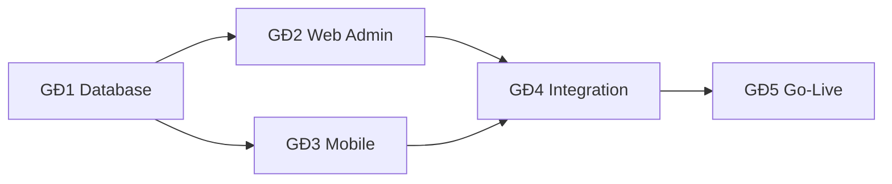

# IMS – PHẦN 18: IMPLEMENTATION ROADMAP

## 18.1. Giai đoạn & milestone

| GĐ | Nội dung | Thời gian | Deliverable | Cổng duyệt |
|---|---|---|---|---|
| 1 | Database + Supabase (migrations, RLS, storage, seed) | Tuần 1–2 | SQL hoàn chỉnh, docs, test RLS | ✅ đang chạy |
| 2 | Web Admin (Next.js) + Core API | Tuần 3–5 | Đủ module quản trị, dashboard, export | sau phase 1 |
| 3 | Mobile App (Flutter) | Tuần 6–8 | Android/iOS build chạy được | sau phase 2 |
| 4 | Integration (Realtime, EF, Resend, FCM, cert, analytics) + Testing | Tuần 9–10 | Hệ thống end-to-end | sau phase 3 |
| 5 | Go-Live (Vercel, Codemagic, prod, monitor, docs, training) | Tuần 11+ | Production | sau phase 4 |

## 18.2. Task chi tiết theo tuần

### Tuần 1
- [x] Cấu trúc repo, rename mobile, init supabase config
- [ ] Viết migration enums + tables + indexes
- [ ] Viết functions/triggers (updated_at, profile trigger, audit)
- [ ] Viết RLS policies đầy đủ

### Tuần 2
- [ ] Storage buckets + policies
- [ ] Realtime publication
- [ ] Seed data (roles, admin, departments, batches, criteria, checklist, templates, location)
- [ ] Script kiểm thử RLS theo 4 role
- [ ] `supabase db reset` + xác nhận (cần Docker) OR kiểm tra production

### Tuần 3
- [ ] Init Next.js (TS, App Router, Tailwind, shadcn)
- [ ] Supabase SSR, middleware role-guard, auth pages
- [ ] Dashboard KPI + charts + alerts

### Tuần 4
- [ ] Interns CRUD + import + detail tabs
- [ ] Mentors, Departments, Internship batches
- [ ] Onboarding + welcome email (Server Action + Resend)

### Tuần 5
- [ ] Tasks (kanban + list + template + comment + attachment)
- [ ] Attendance management + export CSV
- [ ] Requests, Reports approval, Evaluations, Certificates UI

### Tuần 6
- [ ] Flutter skeleton, features/ core, auth, Riverpod setup
- [ ] Dashboard (Intern/Mentor), Profile

### Tuần 7
- [ ] GPS check-in/out (+ EF check-in), Attendance history
- [ ] Tasks, Daily/Weekly report

### Tuần 8
- [ ] Requests (leave/wfh/late), Notifications (FCM)
- [ ] Mentor quick actions; polish UI/UX; build thử

### Tuần 9
- [ ] Deploy EF: check-in, send-email, send-notification, generate-certificate, calculate-evaluation, export-attendance
- [ ] Realtime wiring cho Web + Mobile

### Tuần 10
- [ ] E2E Playwright, unit/integration tests, security scan, fix

### Tuần 11+
- [ ] Vercel prod domain, Supabase prod, Codemagic workflows, backup, monitoring, UAT, docs & training

## 18.3. Dependencies

- GĐ2 và GĐ3 độc lập nhau sau khi DB xong (có thể song song).
- EF `check-in` cần khi GĐ3 mobile. Email/cert cần khi GĐ4.