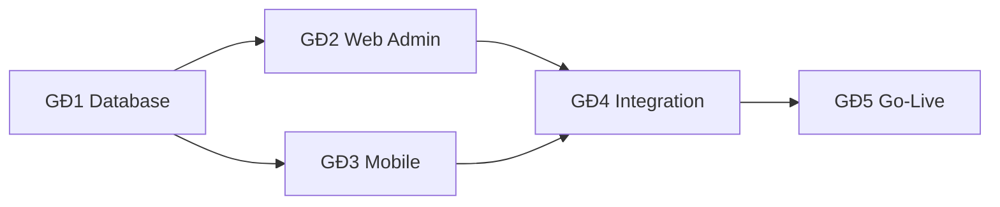

# IMS – PHẦN 18: IMPLEMENTATION ROADMAP

## 18.1. Giai đoạn & milestone

| GĐ | Nội dung | Thời gian | Deliverable | Cổng duyệt |
|---|---|---|---|---|
| 1 | Database + Supabase (migrations, RLS, storage, seed) | Tuần 1–2 | SQL hoàn chỉnh, docs, test RLS | ✅ đang chạy |
| 2 | Web Admin (Next.js) + Core API | Tuần 3–5 | Đủ module quản trị, dashboard, export | sau phase 1 |
| 3 | Mobile App (Flutter) | Tuần 6–8 | Android/iOS build chạy được | sau phase 2 |
| 4 | Integration (Realtime, EF, Resend, FCM, cert, analytics) + Testing | Tuần 9–10 | Hệ thống end-to-end | sau phase 3 |
| 5 | Go-Live (Vercel, Codemagic, prod, monitor, docs, training) | Tuần 11+ | Production | sau phase 4 |

## 18.2. Task chi tiết theo tuần

### Tuần 1
- [x] Cấu trúc repo, rename mobile, init supabase config
- [x] Viết migration enums + tables + indexes (`0001`–`0003`, `0009`)
- [x] Viết functions/triggers (updated_at, profile trigger, audit) (`0004`)
- [x] Viết RLS policies đầy đủ (`0005`)

### Tuần 2
- [x] Storage buckets + policies (`0006`)
- [x] Realtime publication (`0007`)
- [x] Seed data (roles, admin, departments, batches, criteria, checklist, templates, location) (`seed.sql`)
- [x] Script kiểm thử RLS theo 4 role (`scripts/test_rls.sql`)
- [ ] `supabase db reset` + xác nhận (cần Docker / CLI) — **chưa chạy trên máy này**

### Tuần 3
- [x] Init Next.js (TS, App Router, Tailwind, shadcn)
- [x] Supabase SSR, middleware role-guard, auth pages (login, quên/reset mật khẩu)
- [x] Dashboard KPI + charts + alerts

### Tuần 4
- [x] Interns CRUD + **import CSV** + detail tabs
- [x] Mentors, Departments, Internship batches
- [x] Onboarding + welcome email (EF `send-welcome-email` đã viết, chưa deploy)

### Tuần 5
- [x] Tasks (kanban + list + template + comment + attachment)
- [x] Attendance management + export CSV (`/api/exports/attendance` + EF `export-attendance`)
- [x] Requests, Reports approval, Evaluations, Certificates UI

### Tuần 6
- [x] Flutter skeleton (main.dart, core/ supabase, auth/login, home shell)
- [~] Dashboard (Intern/Mentor), Profile — skeleton, chưa compile (máy chưa cài Flutter)

### Tuần 7
- [~] GPS check-in/out (+ EF check-in), Attendance history — skeleton
- [~] Tasks, Daily/Weekly report — skeleton (daily_report)

### Tuần 8
- [ ] Requests (leave/wfh/late), Notifications (FCM) — **chưa có UI mobile**
- [ ] Mentor quick actions; polish UI/UX; build thử — **chưa**

### Tuần 9
- [x] Viết 6 Edge Functions (check-in, send-welcome-email, send-notification, generate-certificate, calculate-evaluation, export-attendance)
- [ ] Deploy EF lên Supabase (cần `supabase` CLI / Deno) — **chưa deploy**
- [~] Realtime wiring cho Web + Mobile — chưa hoàn thiện

### Tuần 10
- [ ] E2E Playwright, unit/integration tests, security scan, fix — **chưa**

### Tuần 11+
- [ ] Vercel prod domain, Supabase prod, Codemagic workflows, backup, monitoring, UAT, docs & training

## 18.3. Dependencies

- GĐ2 và GĐ3 độc lập nhau sau khi DB xong (có thể song song).
- EF `check-in` cần khi GĐ3 mobile. Email/cert cần khi GĐ4.